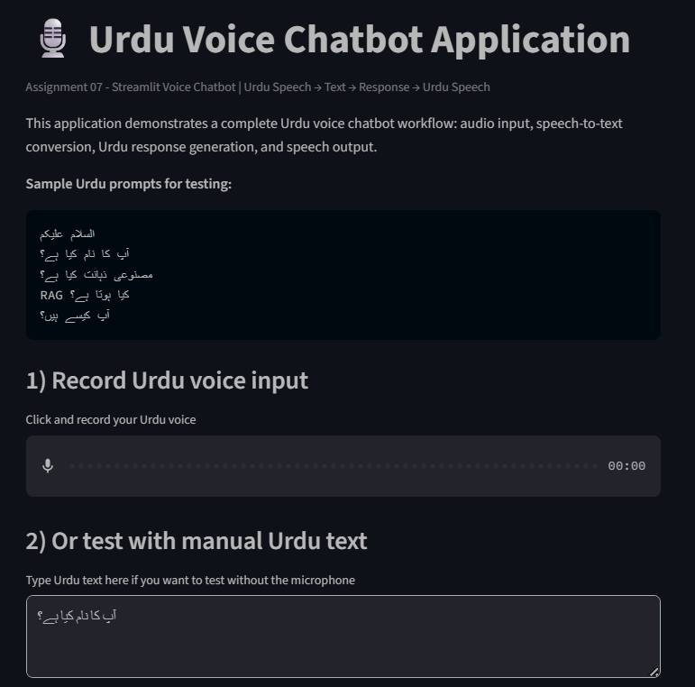
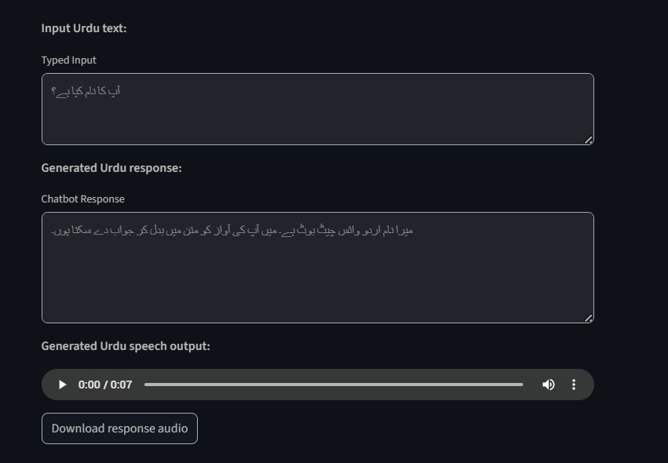

# Assignment 07 — Streamlit Urdu Voice Chatbot Application

This folder contains my seventh coding assignment from the AI Advanced Course. In this project, I built a Streamlit-based Urdu voice chatbot application that accepts Urdu input, processes it, generates a chatbot response, and returns Urdu speech output.

## Project overview

This assignment was focused on building a practical end-to-end chatbot workflow instead of only working with notebook-based experiments. The application demonstrates how a user-facing AI app can combine interface design, Urdu text interaction, speech input, response generation, and speech output in one working system.

## Core features

- Urdu voice chatbot interface built with Streamlit
- browser-based voice input workflow
- manual Urdu text input fallback
- Urdu speech-to-text style interaction flow
- Urdu chatbot response generation
- Urdu text-to-speech output
- downloadable audio response
- lightweight Python app structure with dependency tracking

## Files in this folder

```text
app.py
requirements.txt
assets/
  screenshots/
    home-interface.png
    chatbot-response.png
  audio/
    urdu-chatbot-response.mp3
````

## Application preview

### Main interface



### Generated chatbot response and audio output



## Sample generated audio

You can open the generated response audio here:

[Listen to the Urdu chatbot response](./assets/audio/urdu-chatbot-response.mp3)

## Live application

The deployed Streamlit application can be accessed here:

[Open the live Streamlit app](https://ai-advanced-course-portfolio-kgtmr3smbmzyrwelt5aijt.streamlit.app/)

## Assignment focus

This assignment was designed to help me move from lecture concepts into a usable AI application. It combines interaction design and speech-based workflow building in a simple but practical project.

## Main tasks covered

* build a Streamlit interface for Urdu interaction
* accept Urdu voice or manual Urdu text input
* process the user input
* generate a chatbot response in Urdu
* convert the generated response into playable Urdu audio
* provide downloadable speech output
* package the project with Python dependencies for reproducibility

## How to run locally

### 1. Clone the repository

```bash
git clone PASTE_YOUR_REPO_LINK_HERE
cd AI-Advanced-Course-Portfolio-main/12-rag-and-langchain-pipeline/assignments/assignment-07-streamlit-voice-chatbot-application
```

### 2. Create and activate a virtual environment

#### Linux / macOS

```bash
python -m venv .venv
source .venv/bin/activate
```

#### Windows PowerShell

```bash
python -m venv .venv
.\.venv\Scripts\Activate.ps1
```

### 3. Install dependencies

```bash
pip install -r requirements.txt
```

### 4. Run the Streamlit app

```bash
streamlit run app.py
```

After running the command, Streamlit will open the application in your browser on a local address such as:

```text
http://localhost:8501
```

## Deployment note

This app was deployed using Streamlit so it can be tested as a running application instead of remaining only as source code. That makes the project more practical and portfolio-ready because it shows both implementation and actual usage.

## What I learned

Through this assignment, I learned how to:

* structure a simple Streamlit application
* connect Urdu text and speech interaction into one flow
* organize a small deployable Python project
* move from notebook-style learning into an application format
* document and present an AI assignment in a portfolio-friendly way

## Repository placement

This assignment belongs inside the **RAG and LangChain Pipeline** section of the course portfolio because it reflects the practical application-building phase of the course, where language interfaces, real workflows, and deployable AI systems become the focus.
