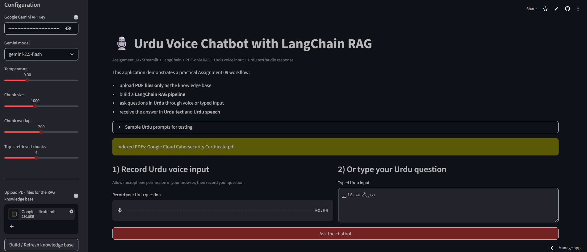
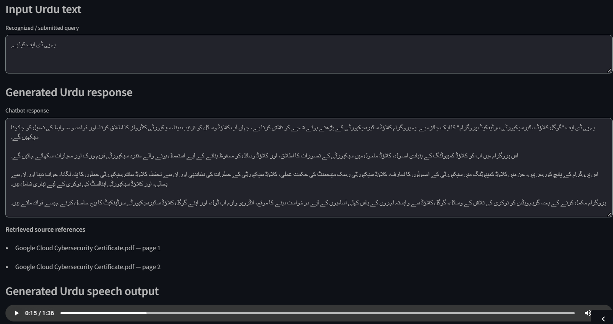

# Assignment 09 — Urdu Voice Chatbot with LangChain RAG

This folder contains my ninth coding assignment from the AI Advanced Course. In this project, I built and deployed a Streamlit-based Urdu voice chatbot that uses a LangChain RAG pipeline over uploaded PDF documents and returns answers in both Urdu text and Urdu speech.

## Project overview

This assignment was focused on building a more practical document-aware AI application. Instead of only creating a chatbot that responds generally, this project was designed to work on top of uploaded PDF files, retrieve relevant content, and generate grounded responses based on those documents.

The final application demonstrates a complete workflow where a user can upload PDF files, ask questions in Urdu through typed or voice input, retrieve relevant context from the uploaded documents, generate an Urdu answer, and listen to that answer as audio.

## Core features

- Streamlit-based interactive web application
- PDF-only knowledge base upload
- LangChain-powered RAG workflow
- Gemini-powered response generation
- Urdu typed input support
- Urdu voice input support
- Urdu text response generation
- Urdu speech output generation
- retrieved source references from PDF pages
- downloadable response audio
- deployable Python app structure for portfolio use

## Files in this folder

```text
app.py
requirements.txt
assets/
  screenshots/
    app-home.png
    app-response.png
  audio/
    urdu-rag-chatbot-response.mp3
````

## Application preview

### Main interface



### Response output, source references, and audio playback



## Sample generated audio

You can open the generated Urdu response audio here:

[Listen to the chatbot response](./assets/audio/urdu-rag-chatbot-response.mp3)

## Live application

The deployed Streamlit application can be accessed here:

[Open the live Streamlit app](https://ai-advanced-course-portfolio-cmhwym8fgecyutftk9tc9k.streamlit.app/)

## Assignment objective

The purpose of this assignment was to move from basic chatbot-style applications toward document-grounded AI systems. This project combines retrieval, generation, multilingual interaction, and deployment into one usable application.

## End-to-end workflow

This application follows this flow:

1. upload one or more PDF documents
2. split the extracted document text into chunks
3. build the retrieval layer for the uploaded documents
4. accept a user query in Urdu by voice or text
5. retrieve the most relevant content from the uploaded PDFs
6. generate a grounded Urdu response
7. convert the generated Urdu answer into speech
8. return the answer with source references and downloadable audio

## Main tasks covered

* build a Streamlit application for document-grounded chatbot interaction
* accept Urdu voice input and typed Urdu input
* upload and process PDF files as the knowledge base
* create a LangChain RAG pipeline
* retrieve relevant chunks from uploaded documents
* generate Urdu responses from retrieved content
* show source references from the uploaded PDFs
* convert Urdu answers into playable speech
* deploy and test the application as a working web app

## Technology stack

* Streamlit
* Python
* LangChain
* Gemini API
* PDF document loading and chunking
* vector-based retrieval
* gTTS for Urdu speech output
* SpeechRecognition for voice input workflow

## How to run locally

### 1. Clone the repository

```bash
git clone PASTE_YOUR_REPO_LINK_HERE
cd AI-Advanced-Course-Portfolio-main/12-rag-and-langchain-pipeline/assignments/assignment-09-urdu-voice-chatbot
```

### 2. Create and activate a virtual environment

#### Linux / macOS

```bash
python -m venv .venv
source .venv/bin/activate
```

#### Windows PowerShell

```bash
python -m venv .venv
.\.venv\Scripts\Activate.ps1
```

### 3. Install dependencies

```bash
pip install -r requirements.txt
```

### 4. Add your Gemini API key

For local testing, export your API key in your environment or configure it through Streamlit secrets.

### 5. Run the Streamlit app

```bash
streamlit run app.py
```

After running the command, the app will open in your browser on a local address such as:

```text
http://localhost:8501
```

## How to test the app

Use this simple testing flow:

1. open the application
2. enter your Gemini API key
3. upload a text-based PDF
4. click **Build / Refresh knowledge base**
5. ask a question in Urdu using typed input or microphone input
6. review the generated Urdu answer
7. verify the retrieved source references
8. play the generated Urdu speech
9. download the response audio if needed

## Deployment note

This application was deployed on Streamlit so it could be tested as a real working AI application rather than staying only as local source code. That made the project more practical, portfolio-ready, and closer to how document-grounded AI tools are used in real workflows.

## What I learned

Through this assignment, I learned how to:

* build a Streamlit application around a document-grounded chatbot workflow
* work with PDF ingestion and retrieval logic
* structure a simple LangChain RAG pipeline
* combine typed input, voice input, and speech output in one application
* generate responses tied to uploaded document context
* display source references for better answer grounding
* deploy and test a working AI app from GitHub

## Practical outcome

This project helped me move beyond notebook-only experimentation into an actual AI application that users can interact with. It also strengthened my understanding of how retrieval-based systems differ from normal chatbots by grounding the answer in uploaded documents.

## Repository placement

This assignment belongs inside the **RAG and LangChain Pipeline** section of the course portfolio because it represents the practical implementation stage of document-grounded AI systems, multilingual interaction, retrieval-based workflows, and deployable AI application building.
